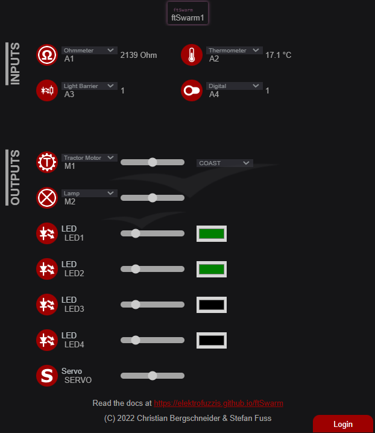

## Motor & Switch

The first application is not about writing "Hello World" on a display. It's just to control a motor with a simple switch. 
Therefore you need a ftSwarm, a switch, a motor and a 9V power supply.

The hardware setup is easy:

- Connect a motor or a lamp to output M2 of your ftSwarm.
- Connect a switch to input A1.
- Connect a 9V power supply to PWR.
- Connect the ftSwarm via USB cable with your computer.

Start you Arduino IDE. Select `ESP32 Dev Module` in `Tools\Board\ESP32 Arduino` and the serial port of your device in `Tools\Port`.
Write the following code and upload it to your device. Whenever you press your switch, the motor starts running. If you release the switch, the motor stops.

```
#include "ftSwarm.h"

FtSwarmSwitch *sw;
FtSwarmMotor  *mot;

void setup( ) {

  // start the swarm
  FtSwarmSerialNumber_t local = ftSwarm.begin( );
	
  // get switch and motor instances
  sw  = new FtSwarmSwitch( local, FTSWARM_A1 );
  mot = new FtSwarmMotor( local, FTSWARM_M2 );

}

void loop( ) {

  // check if switch is pressed or released
  if ( sw->isPressed() )
    mot->setSpeed(255);
  else
    mot->setSpeed(0);
	
  // wait some time
  delay(100);

}
```

The application is quite easy to understand. `#include "ftSwarm.h">` includes the ftSwarm-Library to access the ftSwarm firmware. 
Afterwards two pointers for `switch` and `motor` are defined. In setup routine your swarm starts with 

```
FtSwarmSerialNumber local = ftSwarm.begin( );
```

The result is the serial number of your local controller. With this serial number, you could now instantiate switch and motor:

```
sw  = new FtSwarmSwitch( local, FTSWARM_A1 );
mot = new FtSwarmMotor( local, FTSWARM_M2 );
```

Due to the architecture of the firmware, you could not access an IO before your swarm is started.
With instantiating an IO, the firmware waits until the IO joins the swarm. If the swarm is not started, your apllication will wait forever. 
To work with global objects, they need to be defined as pointers. So you are able to instantiate them after starting your swarm.

The main loop is just about querying the switch state and starting/stopping the motor:

```
if ( sw->isPressed() )
  mot->setSpeed(255);
else
  mot->setSpeed(0);
```

Let's have a look on the swarm monitor. If you already added your ftSwarm device to your local wifi, you just need to access 
`http:\\ftSwarm<SerialNumber>` with your browser. Replace <SerialNumber> with your ftSwarm's serial number. If you press the switch,
you will see the status changes at the ftSwarm's monitor page:



