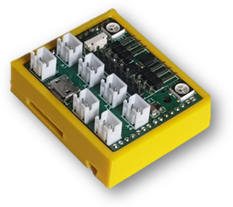
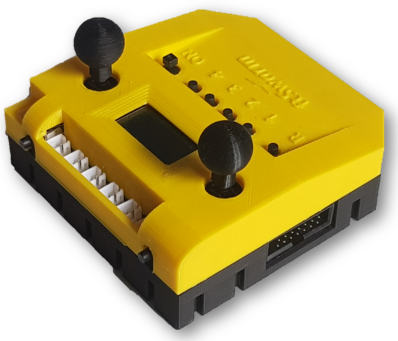

## The ftSwarm Project

The goal of the ftSwarm project is to build small networked controllers for DIY and toy applications. 
Since they are networked with each other, they can act like a swarm. For example, they can act as several independent robots to solve a task together. 
In larger models, the controllers can be installed at different positions close to actuators and sensors - together they control the complete model.

Originally, the project was designed to use with *fischertechnik*. Since the mounting grooves are compatible with Makerbeam profiles, ftSwarms could be used in many DIY projects. 

	
 
		 Although the ftSwam is as small as a matchbox with only 45.0 x 37.5 x 17 mm, it can control two 9V DV motors,
		 up to 16 RGB LEDs, one servo and read out 4 analog or digital sensors.
	

	
 
	     As a control panel, the ftSwarmControl has, in addition to 2 joysticks, 8 buttons and an LCD display, 
		 the ability to control 2 DC motors and read 4 digital sensors.
	

	 

Since building this hardware on your own is a little bit tricky, you could purchase it at [www.gundermann.org](www.gundermann.org).
